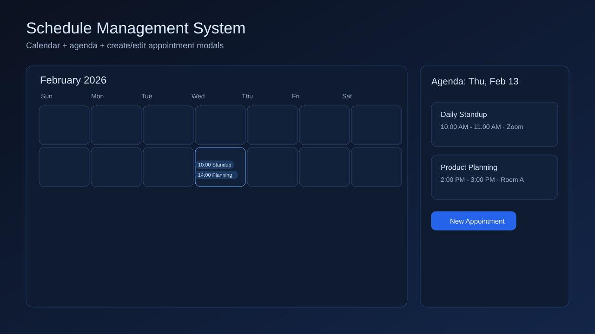

# Schedule Management System

Project layout uses:
- `server/` for the backend gRPC service
- `client/` for the frontend app
- `envoy/` for gRPC-Web proxy configuration

## UI Preview



## Prerequisites

- Docker + Docker Compose
- Node.js 20+ and npm (use `nvm use` in client/ directory)

## Structure

- `server/`: Go service, domain logic, repository layer, and proto files.
- `client/`: React + Vite UI with gRPC client stubs/hooks.
- `envoy/`: Envoy config to expose gRPC service to browser clients.
- `docker-compose.yml`: local multi-service orchestration.
- `DECISIONS.md`: architecture and tradeoff notes.

## Quick Start

### Option 1: Full Stack with Docker (Recommended)

Start all services (database, server, envoy, client) with one command:

```bash
make dev
```

Expected endpoints:
- Client: `http://localhost:5173`
- Envoy gRPC-Web: `http://localhost:8080`
- Envoy admin: `http://localhost:9901`
- Server gRPC: `localhost:50051`

### Option 2: Local Development (Faster Iteration)

For faster frontend development with hot reload:

```bash
# 1. Install dependencies
make install

# 2. Start backend services (database, server, envoy)
docker compose up postgres server envoy -d

# 3. Start frontend dev server (in new terminal)
cd client
npm run dev
```

This runs the React dev server locally while backend runs in Docker.

**Using nvm (recommended):**
```bash
cd client
nvm use          # Auto-detects Node 20 from .nvmrc
npm run dev
```

### Seed Test Data (Optional)

Populate the database with 100 realistic test appointments:

```bash
make seed
```

Clear the database:

```bash
make reset
```

## Clean Bootstrap Verification

From a fresh clone, use:

```bash
npm install
docker compose up --build -d
npm run verify:e2e
```

The `verify:e2e` command runs `scripts/verify_envoy_connectivity.sh` and validates:
- Create appointment (via Envoy)
- List appointments (via Envoy)
- Delete appointment (via Envoy)

For a full clean reset before retesting:

```bash
docker compose down -v
docker compose up --build -d
npm run verify:e2e
```

## Database Management

### Seed Test Data

Generate 100 realistic test appointments spanning 2 years (including recurring appointments):

```bash
make seed
```

This creates:
- 20 recurring appointments (daily, weekly, and monthly patterns)
- 80 regular appointments with varied statuses
- Realistic business hours scheduling (8 AM - 5 PM, weekdays)
- Diverse meeting types, locations, and attendees

### Reset Database

Clear all appointments and events from the database:

```bash
make reset
```

## Development Commands

From the root directory:

```bash
make install    # Install all dependencies (Go + npm)
make dev        # Start full stack with Docker Compose
make test       # Run server tests
make proto      # Regenerate protobuf files
make clean      # Clean everything (Docker volumes, builds, node_modules)
```
